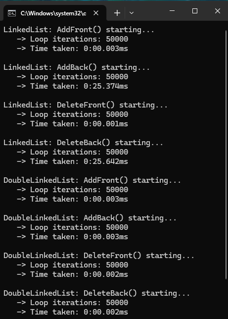

# Data-Structures

Data structures written across different languages. Project is being used to practice and better understand common data structures.

## LINKED LIST (C#)

Single and Double Linked List. Data structures provide add/delete Nodes from front, back and specific index position of a list. Main program tests 50,000 Nodes added/deleted from front/back across both types of list structures. See image below for speed comparisons.

## STACK (C#)

